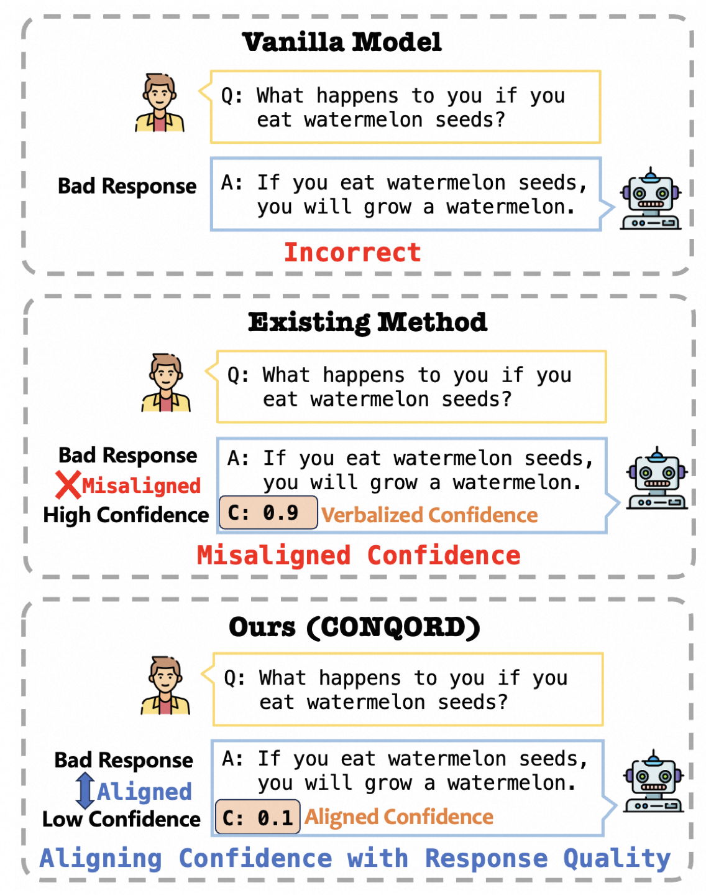

# When to Trust LLMs: Aligning Confidence with Response Quality

This includes the original implementation of [When to Trust LLMs: Aligning Confidence with Response Quality](https://arxiv.org/abs/2404.17287) (ACL 2024) by Shuchang Tao, Liuyi Yao, Hanxing Ding, Yuexiang Xie, Qi Cao, Fei Sun, Jinyang Gao, Huawei Shen, and Bolin Ding.

**CONQORD** is an innovative framework aimed at enhancing the reliability of large language models (LLMs) in natural language generation by aligning confidence with response accuracy.

LLMs frequently produce incorrect or nonsensical outputs. Traditional methods typically depend on confidence levels to indicate reliability. In contrast, **CONQORD** employs reinforcement learning driven by a unique dual-component reward function that combines quality rewards with order-preserving alignment rewards. This approach encourages the model to express higher confidence for more accurate responses, effectively synchronizing confidence levels with accuracy and improving the overall reliability of generated text. Furthermore, the aligned confidence provided by CONQORD informs when to trust LLMs, and acts as a determinant for initiating the retrieval process of external knowledge.



If you find our code, models, or the paper useful, please cite the paper:

```latex
@inproceedings{Tao2024,
  author       = {Shuchang Tao and
                  Liuyi Yao and
                  Hanxing Ding and
                  Yuexiang Xie and
                  Qi Cao and
                  Fei Sun and
                  Jinyang Gao and
                  Huawei Shen and
                  Bolin Ding},
  title        = {When to Trust LLMs: Aligning Confidence with Response Quality},
  journal      = {CoRR},
  volume       = {abs/2404.17287},
  year         = {2024},
  url          = {https://doi.org/10.48550/arXiv.2404.17287},
  doi          = {10.48550/ARXIV.2404.17287},
  eprinttype    = {arXiv},
  eprint       = {2404.17287},
  timestamp    = {Mon, 03 Jun 2024 20:48:03 +0200},
  biburl       = {https://dblp.org/rec/journals/corr/abs-2404-17287.bib},
  bibsource    = {dblp computer science bibliography, https://dblp.org}
}
```


## Installation

python 3.9

torch

tensorboardX

transformers

deepspeed

huggingface_hub


numpy

scipy

pandas

re

asyncio


## Training and Evaluation

### Step1 Supervised fine-tuning reward LM

> Please run "CONQORD/step1_supervised_finetuning_LM/run_step1.sh"

**Step 1.0**: Downloading dataset from https://huggingface.co/datasets/Dahoas/rm-static, and save them to ../datasets/Dahoas

**Step 1.1**: Downloading the foundation model, such as LLAMA2, Mistral or Zephyr from huggingface ad save them to ../model_pth

**Step 1.2**: Create log, checkpoint, tensorboard folders

**Step 1.3**: Run main.py in step1

```
export CUDA_VISIBLE_DEVICES=0,1,2,3 nohup deepspeed --master_port 13001 main.py \
   --data_path ../datasets/Dahoas/rm-static_conf_both/ \
   --data_split 10,0,0 \
   --model_name_or_path ../model_pth/llama2_hf_7b/ \
   --per_device_train_batch_size 32 \
   --per_device_eval_batch_size 32 \
   --data_output_path ../datasets/datatmp/ \
   --max_seq_len 512 \
   --learning_rate 1e-4 \
   --weight_decay 0. \
   --num_train_epochs 3 \
   --gradient_accumulation_steps 64 \
   --lr_scheduler_type cosine \
   --num_warmup_steps 5 \
   --seed 1234 \
   --gradient_checkpointing \
   --zero_stage 3 \
   --deepspeed \
   --lora_dim 128 \
   --lora_module_name "layers." \
   --output_dir checkpoint/step1 \
   --print_loss \
   --enable_tensorboard \
   --tensorboard_path tensorboard/step1 \
   &> log/step1.log 2>&1 &
```


### Step2 Training reward model

> Please run "CONQORD/step2_reward_model/run_step2.sh"

**Step 2.1**:Downloading dataset from https://huggingface.co/datasets/Anthropic/hh-rlhf, and save them to ../datasets/Anthropic/hh-rlhf/

**Step 2.2**: Run main.py in step2


```
export CUDA_VISIBLE_DEVICES=0,1,2,3 nohup deepspeed --master_port 23001 main.py \
   --data_path ../datasets/Anthropic/hh-rlhf/helpful-base \
   --data_split 0,10,0 \
   --model_name_or_path ../model_pth/llama2_hf_7b/ \
   --data_output_path ../datasets/datatmp/ \
   --per_device_train_batch_size 32 \
   --per_device_eval_batch_size 32 \
   --max_seq_len 512 \
   --learning_rate 5e-5 \
   --weight_decay 0.1 \
   --num_padding_at_beginning 0 \
   --num_train_epochs 10  \
   --gradient_accumulation_steps 16 \
   --lr_scheduler_type cosine \
   --num_warmup_steps 0 \
   --seed 1234 \
   --gradient_checkpointing \
   --zero_stage 3 \
   --deepspeed \
   --offload \
   --lora_dim 128 \
   --lora_module_name "layers." \
   --output_dir checkpoint/step2 \
   --enable_tensorboard \
   --tensorboard_path tensorboard/step2 \
   &> log/step2.log 2>&1 &
```


### Step3 RL Fine-tuning LLM

> Please run "CONQORD/step3_RL_finetune_LLM/run_step3.sh"

**Step 3.1**: Prepared the actor model in step1 and the critic model in step2.

**Step 3.2**: Run main.py in step3

```
export CUDA_VISIBLE_DEVICES=0,1,2,3 nohup deepspeed --master_port 33001 main.py \
   --data_path ../datasets/Anthropic/hh-rlhf/helpful-base_conf_half_sharp \
   --data_split 0,0,10 \
   --actor_model_name_or_path ../step1_supervised_finetuning_LM/checkpoint/step1/final \
   --tokenizer_model_name_or_path ../model_pth/llama2_all_hf/llama2_hf_7b/ \
   --critic_model_name_or_path ../step2_reward_model_finetuning/checkpoint/step2/ep3/ \
   --num_padding_at_beginning 1 \
   --per_device_generation_batch_size 1 \
   --per_device_training_batch_size 1 \
   --generation_batches 1 \
   --ppo_epochs 1 \
   --max_answer_seq_len 256 \
   --max_prompt_seq_len 256 \
   --actor_learning_rate 1e-6 \
   --critic_learning_rate 1e-6 \
   --actor_weight_decay 0.1 \
   --critic_weight_decay 0.1 \
   --num_train_epochs 1 \
   --lr_scheduler_type constant \
   --gradient_accumulation_steps 32 \
   --actor_gradient_checkpointing \
   --critic_gradient_checkpointing \
   --offload_reference_model \
   --disable_actor_dropout \
   --num_warmup_steps 0 \
   --deepspeed --seed 1234 \
   --actor_zero_stage 3 \
   --critic_zero_stage 3 \
   --enable_hybrid_engine \
   --actor_lora_dim 64 \
   --critic_lora_dim 64 \
   --critic_lora_module_name "layers." \
   --actor_lora_module_name "layers." \
   --output_dir checkpoint/step3 \
   --enable_tensorboard \
   --tensorboard_path tensorboard/step3 \
   &> log/step3.log 2>&1 &
```


### Step4 Evaluation

> Please run "CONQORD/step4_evaluation/run_step4.sh"

**Step 4.1**: CONQORD Inference

    nohup python -u test_conqord.py --data_name truthful_qa \
    --mode llama2_7b \
    --suffix conqord_llama2_nq \
    --path ../step3_rlhf_finetuning/checkpoint/step3_RL_finetune_LLM/ep1/step30/actor \
    --gpu 2 > ./log/truthful_qa/conqord_llama2.log 2>&1 &

**Step 4.2**: Evaluating performance for CONQORD

```
nohup python -u gpt_evaluation.py --data_name truthful_qa --suffix conqord_llama2 --mode llama2_7b --gpu -1 > ./log/truthful_qa/conqord_llama2.log 2>&1 &
```


## Contact

If you have questions, please open an issue mentioning @ or send an email to shuchangtao5@gmail.com